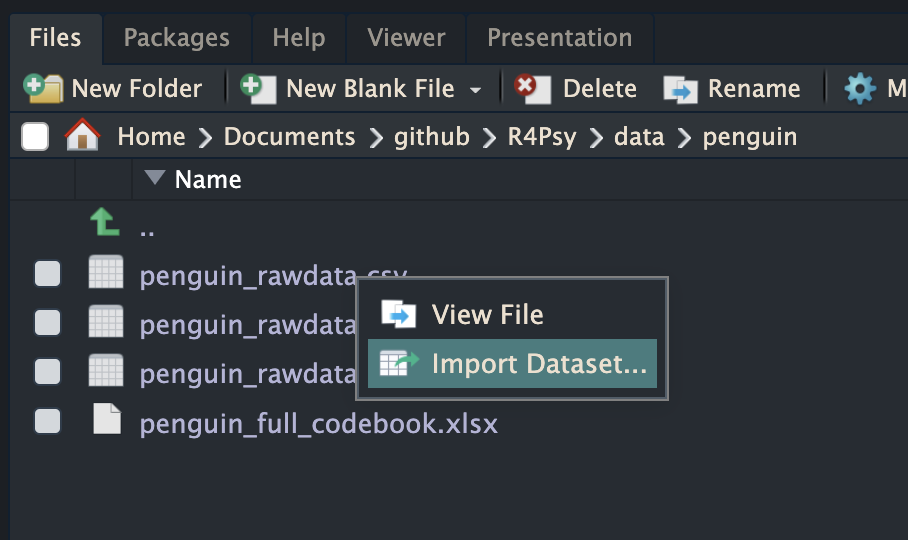
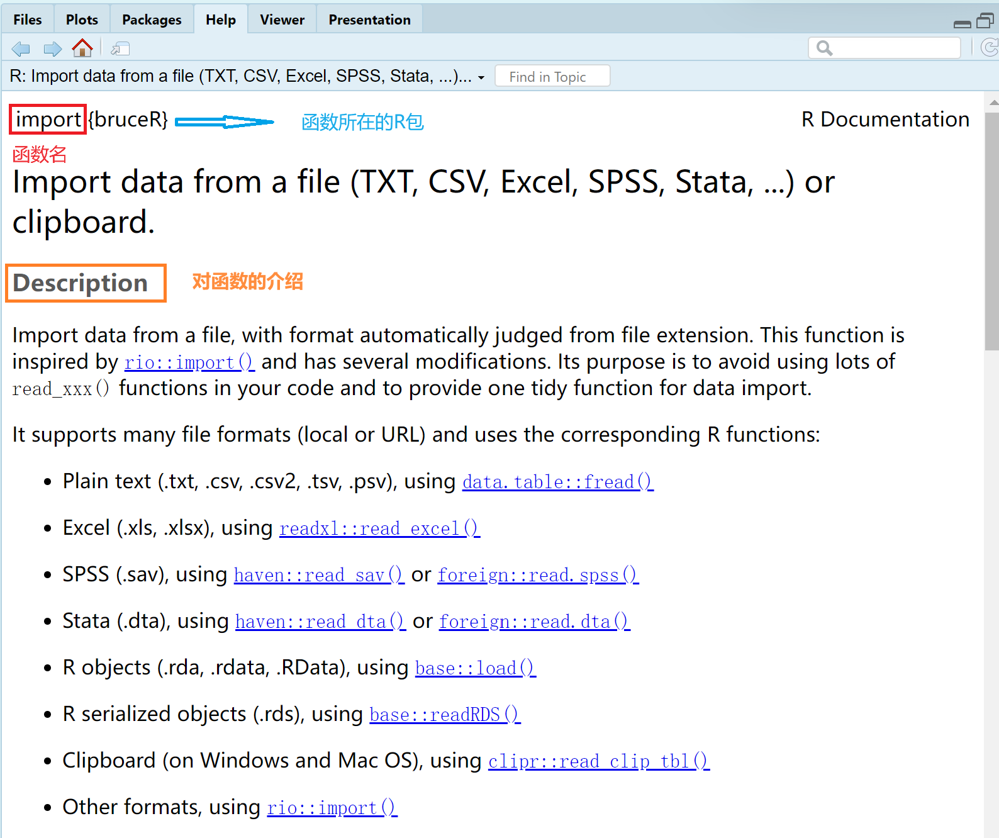

# 第四讲 & 第五讲 ：数据导入 -- 数据类型与结构{#lesson-4}


今天我们正式开始用r来处理数据。记得去年教授这门课程时，有同学遇到了报错和乱码的问题，无法正常显示，这是因为部分语言设置不正确。为避免此类问题，大家可以将自己的编程语言设置为英文，这样就不会出现乱码了。也就是说，当你遇到报错时，如果系统默认语言是中文，那么在输出时可能会有乱码，无法被识别，这是一个小问题。将界面语言设置成英文的代码如下：

```r
# set local encoding to English
if (.Platform$OS.type == 'windows') {
  Sys.setlocale(category = 'LC_ALL','English_United States.1250')
} else {
  Sys.setlocale(category = 'LC_ALL','en_US.UTF-8')
}
# set the feedback language to English
Sys.setenv(LANG = "en") 
```

在开始分析数据数据之前，我们需要加载分析数据时所需要的包，一般使用`library()`函数。但更推荐大家使用名为`packman`（Package Management ）的包来加载，使用`pacman::p_load`不仅可以批量加载包，而且遇到没有安装的包时会自动为我们安装。


```r
if (!requireNamespace('pacman', quietly = TRUE)) {
    install.packages('pacman')
}
pacman::p_load(bruceR,here)
```

## 加载数据

既然我们要开始处理数据，而R作为一种工具，是解决数据分析问题的关键。我们需要将R整合到数据分析流程中，用R来完成整个数据分析过程。数据分析的第一步通常是获取数据。对于心理学专业的同学来说，大多数人获取数据的方式是通过自己进行实验和发放问卷来收集数据，并通过问卷平台或实验数据收集工具将数据汇总。而在其他情况下，获取数据的方式可能会有所不同。例如，你毕业后可能会在其他地方工作，此时你遇到的数据可能不是通过实验收集的，而是需要通过网络或其他途径来获取，或者可能是别人交给你的未经整理的数据。


在处理数据之前，你可能需要进行一些额外的步骤，比如通过网络爬虫技术来爬取数据，这是一种获取数据的方式。假设现在大家手头已经有了一些数据，接下来，我们要探讨的是如何将这些数据导入到我们的数据分析软件中。对于本科毕业论文，我们都知道SPSS是如何导入数据的。

同样，我们也可以尝试在R环境中进行类似的操作，比如在R Studio的界面中，我们通过File-Import Dataset选项中手动导入数据，选择数据打开后，在右上角的 Environment 界面中会显示已导入的数据的名称。但是如果我们要导入的数据非常多时，或者我们需要将许多分散的数据合并成一个数据时，使用手动点击的方式一个个导入就会非常费时费力，因此代码会是效率更高的选择。

在课程中，我们会遇到两个主要的数据集，一个是Human Penguin Project问卷数据集，另一个是Perceptual matching 实验数据集。我们刚才通过点击操作完成了数据导入并查看了问卷数据，现在则要通过代码来完成相同的操作，包括尝试选择一些变量进行初步统计。这就是我们在数据分析中遇到的第一个问题。本节课的主要目标就是要解决这一问题。


## 数据导入
### 数据的“地址”——路径
如果我们希望通过代码来导入数据，那么首先需要告诉电脑数据“住在”哪里（address），即到哪个文件夹来寻找数据。如果只是在文件夹中以点击的方式来寻找我们想要的数据，比要在 R4Psy 中找到名为 penguin_rawdata.csv 的数据，则需要按照以下步骤进行点击（以 Macos 系统为例）：  


如果将点击文件夹的名称按顺序组合起来，并且中间使用斜杠(/)作为分隔符，就形成了计算机寻找文件的路径："./data/penguin/penguin_rawdata.csv" 或 "data/penguin/penguin_rawdata.csv"（注意，路径的前后都需要有引号，单引号双引号都可以，具体原因会在这节课的结尾解释）。

但是很容易发现，在 R4Psy 文件之前仍然存在文件夹，如果一直追溯的话会发现路径会变得非常非常长：  

完整的路径写成代码的话应该表示为："/Users/cz***/Documents/github/R4Psy/data/penguin/penguin_rawdata.csv"。

### 绝对路径与相对路径

对于这两种路径，后者（即完整的路径）称为绝对路径，而前者（不完全的路径）称为相对路径，二者区别在于是否要设置一个文件夹所谓搜索的起始点，比如在上面例子中，相对路径设置了
 R4Psy 作为搜索的起始点，而绝对路径则从硬盘所在的文件夹开始搜索。显然，就写法而言相对路径会更加轻松。而这个起始文件夹被称为工作路径(working directory，绝对路径 = 工作路径+相对路径)，如果设定了工作路径，在工作路径之前的内容就可以省略不写。
 
在RStudio 的 global options-General中可以设置默认的工作路径；当然，也可以使用`setwd()`函数来手动修改，使用`getwd()`函数来查看当前的工作路径；另外， Rmarkdown(.Rmd) 和Rproject(.Rproj)这两种文件对于路径的处理会比较特殊，它们会默认将文件所在的地址作为工作路径，这非常有利于和别人分享你的结果：我们一般会将打包放在和 Rmarkdown 文件相同路径的文件夹中，如果你将 Rmarkdown 及数据打包分享给他人时，别人使用你的 Rmarkdown 来加载数据，比如 R4Psy 文件夹，尽管在别人的电脑中 R4Psy 之前的路径和你完全不同，但别人运行 Rmd 文件时完全不用对路径做任何修改，也不用重新修改默认的工作路径。

对于工作路径的设置，除了使用 `setwd()`函数外，还可使用 bruceR 包中的`set_wd(ask = T)`或`set.wd(ask = T)`进行设置，另参数 ask = T 可以调出可视化界面通过点击的方式进行选择。

在 Windows 系统中道理是一样的，但如果大家点击地址栏的话，会发现路径的分隔符使用的是反斜杠（\\）而非上里面例子中所展示的(/)：


<div class="center">
    

在 R语言中，路径分隔符要求为斜杠（/），注意不能直接从路径栏中直接复制地址。这是一个非常细节的问题，但也有更加方便的方式来解决这个问题，即使用`here::here()`函数，只需要在这个函数中按顺序依次输出，比如对于上面的相对路径就可以写为：  

```r
here::here('data','penguin','penguin_rawdata.csv')
```


## 读取数据
### 手动导入
在设置好工作路径后，可以在 Files 窗口中直接点击数据，这个过程与 SPSS 或 Excel 里导入数据的操作类似。



### 代码导入
当然，我们更推荐使用代码的方式来导入数据：

```r
penguin_data = bruceR::import(here::here('data', 'penguin', 'penguin_rawdata.csv'))
ncol(penguin_data)
```

```
## [1] 247
```

```r
nrow(penguin_data)
```

```
## [1] 1523
```


```r
head(penguin_data)
tail(penguin_data)
```

在上面的代码中，我们使用了 bruceR 包中的 import 函数来导入 penguin_rawdata.csv文件，并将数据命名为penguin_data（即等号'='）；导入成功后，可以在 Environment 界面中看到这个名称，如果在 console 界面中输入penguin_data，就会返回具体的数据内容；使用 `head()`或`tail()`可以查看数据的前 5 行或最后 5 行。`ncol()`和`nrow()`分别查看数据的列数与行数。  

（如果 bruceR包已经加载了，在代码中`bruceR::`部分是可以省略不写的，对于简单的数据处理来说没有问题，但随着数据处理与分析的难度增加，会用调用非常多的包，有时候不同包之间会存在有相同变量名的函数，如果不声明函数来源于哪个包的话，要么 R语言会提示函数存在冲突，要么本来想用 A 包中的函数，但实际上执行了 B 包中的同名函数，因而出现报错。因此建议大家现在就养成在函数声明其来源的好习惯）

如果大家之前使用点击的方式来导入数据，会发现在 console 中会显示导入数据的代码，代码中使用的是`read.csv()`函数，而我们更推荐使用`import()`函数作为替代，因为`import()`函数对于心理学常见数据几乎都是适用的(如txt,csv,sav,dta等等，可通过`?bruceR::import()`查看具体信息)，而`read.csv()`只适用于 csv 类型的数据。


## 赋值
在导入数据时，我们使用了等号进行赋值。而在R中，赋值操作符可以使用“<-”，也可以使用“=”，二者是等价的。

```r
x = 1
y = x + 5
## cat函数将值的内容输出到屏幕上
x
```

```
## [1] 1
```

```r
y
```

```
## [1] 6
```

```r
## 重新对 x 进行赋值
x = 1000
## x
x
```

```
## [1] 1000
```

```r
y
```

```
## [1] 6
```

通过上面的例子可以发现，对 x 进行赋值，并利用 x 进行计算后，更改 x 的值并不会影响 y的结果。此外，如果仅仅只是利用数据进行计算而没有复制操作的话，计算结果并不会被保存：

```r
object <- 10
object
```

```
## [1] 10
```

```r
# 利用 object 进行计算但不赋值
object + 2
```

```
## [1] 12
```

```r
# object 数值并没有发生改变
object
```

```
## [1] 10
```

此外需要注意的是，R语言中的变量名的命名有一系列的规则：

-   区分大小写，'Object'和'object'是两个不同的变量名；

-   变量名内不能使用空格，但可以用下划线代替空格；

-   变量名开头不能是数字和一些特殊符号(如+-*/) ；


## 数据类型
在读取数据后，我们需要知道数据中的具体内容有哪些，但这里就需要了解一些与数据类型相关的知识。在 SPSS 中的变量视图中，不同的变量可能会有不同的数据类型，如名义、标度、有序等，Excel 中对于单元格也可以去选择常规、数值、货币、日期等类型，R 语言也是一样。

可以观察一下我们导入的 pengui_data 数据，可以发现对于每个单元格来说，大概可以分为两类，一种是数字，一种是文字；而数字也有整数和小数之分。凭直觉来说，数字是可以进行加减乘除等运算的，而文字（如‘Oxyford’）不能（实际上也确实如此）。  


在R语言中，数据类型可以简单分为三类：

#### 数值型(numeric)
包括浮点型(double,即小数)、整型(int)等，可以进行数学运算；

```r
# 简单做个加法
1 + 1
```

```
## [1] 2
```

```r
## 直接输入pi会返回圆周率
pi
```

```
## [1] 3.141593
```

```r
## 幂运算
10^3
```

```
## [1] 1000
```

```r
## 取对数
log(1)
```

```
## [1] 0
```
使用`class()`函数（即类）可以查看具体是什么数据类型，比如：

```r
class(pi)
```

```
## [1] "numeric"
```


#### 字符串(character)
即文字内容，但需要注意的是，字符串的前后需要被英文的引号所包裹，单引号双引号都行。无论内容是什么，只要前后存在引号，R语言都会将其识别为字符，哪怕其中是乱码：

```r
class('1 + 1')
```

```
## [1] "character"
```

```r
class("ㄤ娇鐢ㄦ鏂囦欢锛")
```

```
## [1] "character"
```

```r
##  之前提到的路径，其实也是字符串，所以需要加引号
class(getwd())
```

```
## [1] "character"
```


#### 逻辑值(logical)
即布尔值。大家肯定都听说过计算机使用二进制 0 和 1来表示“关”和“开”或“假”和“真”；逻辑值与此类似，即True 为真（对），False 为假（错），分别可以简写为 T 和 F。逻辑值通常是比较运算的结果：

```r
2 > 1
```

```
## [1] TRUE
```

```r
T == TRUE
```

```
## [1] TRUE
```

```r
T > F
```

```
## [1] TRUE
```

```r
class(2 > 1)
```

```
## [1] "logical"
```


常见的比较运算符如下图：


## 数据结构

之前的内容介绍了三种数据类型（相当于数据中的某一个单元格），数据类型之间可以相互组合，进而形成了丰富的数据结构：


### 向量(vector)
数值、字符串、逻辑值都可以各自组合在一起，可以分别组成数值向量、字符串向量、逻辑向量。可以使用`c()`来建立向量（c可以理解为 combine），但需要注意的是，向量里的类型必须相同，因此使用 class()来查询向量类型时，会返回向量中具体的元素类型，而不是 vector。

```r
## 数值型向量
v1 <- c(1,2,3,4,5)
# 对于连续数字可以使用冒号简写，即从1到(:)5
# 在连续数字或单个元素时可以省略c()
v1 = 1:5

## 字符型向量
v2 <- c('apple','pear','banana','strawberry','lemon')
# 每个元素都要写一遍引号非常麻烦
# 因此可以使用 bruceR 包中的 cc()函数，开头结尾有引号即可
v2 <- bruceR::cc('apple,pear,banana,strawberry,lemon')

## 逻辑型向量
v3 <- c(T,F,F,T,T)

## 使用 class查看，并不会返回vector
class(v1)
```

```
## [1] "integer"
```

#### 类型转换
那么可能会有人有疑问，如果在一个向量里面同时包含不同类型的数据会出现什么结果：

```r
## 数值和逻辑
x1 = c(T,2)
class(x1)
```

```
## [1] "numeric"
```

```r
## 数值和字符串
x2 = c(2,'a')
class(x2)
```

```
## [1] "character"
```

```r
## 逻辑值和字符串
x3 = c(T,'a')
class(x3)
```

```
## [1] "character"
```

```r
## 数值型、逻辑型和字符串
x4 = c(1,T,'a')
class(x4)
```

```
## [1] "character"
```
可以发现，如果数值型和逻辑值同时出现，则会被强制转换为数值型向量；如果数值型或逻辑型与字符串同时出现，则会强制转换为字符串向量，这就是 R语言中数据类型的强制转换机制。当然这也提醒我们，不同类型之间的数据是可以相互转换的，而在 R 语言中也存在以 as.开头的函数执行转换操作：


```r
as.character(1:3)
```

```
## [1] "1" "2" "3"
```

```r
as.numeric(c('1','2','a')) 
```

```
## Warning: NAs introduced by coercion
```

```
## [1]  1  2 NA
```

```r
as.numeric(c(T,F))
```

```
## [1] 1 0
```
在上面例子中，需要注意第二个例子。字母本身并不能转换成数字，因而使用 NA 进行替换；而 NA(Not Available) 指数据中的缺失值。

和 as.系列函数相类似的还有is.系列函数，用于判断数据是否是某个数据类型，比如

```r
is.character(1)
```

```
## [1] FALSE
```

```r
is.na(1)
```

```
## [1] FALSE
```

```r
is.numeric(1)
```

```
## [1] TRUE
```


#### 向量化操作
在 R语言中，向量有着独特的运算方式：

```r
x = 1:6  
x + 1
```

```
## [1] 2 3 4 5 6 7
```

```r
x * x
```

```
## [1]  1  4  9 16 25 36
```
可以发现，对 x 向量进行加一的运算会返回对x 中每一个元素进行加一运算；而向量之间的相乘会返回每个元素乘积所形成的向量，这种操作称为向量循环。


#### 向量的索引
如果想要提取向量中的某个值，可以在中括号中输入数字向量进行索引：

```r
v2 <- c('apple','pear','banana','strawberry','lemon')
## 查找第 1 个元素
v2[1]
```

```
## [1] "apple"
```

```r
## 查找第 2 和第 4 个元素
v2[c(2,4)]
```

```
## [1] "pear"       "strawberry"
```

```r
## 查找第 1 个到第 4 个元素
v2[1:4]  
```

```
## [1] "apple"      "pear"       "banana"     "strawberry"
```

```r
## 负索引（ = 删除元素）
## 删除前两个元素
v2[-c(1:2)]
```

```
## [1] "banana"     "strawberry" "lemon"
```

```r
## 也可以利用索引对元素进行更改
v2[1:2] = bruceR::cc('APPLE,PEAR')
v2
```

```
## [1] "APPLE"      "PEAR"       "banana"     "strawberry" "lemon"
```


#### 因子(factor)

对于心理学专业的同学来说，因子这个词应该非常熟悉了，因子分析是对于问卷数据来说是常用的方法之一，但这里的因子与因子分析中的因子概念并不相同。  
在统计中，我们将数据分为称名数据、顺序数据、等距数据、等比数据四种类型，而因子这一数据结构（容器），专门用来存放称名数据和顺序数据。

相较于字符串，直接用字符向量也可以表示分类变量，但它只有字母顺序，不能规定想要的顺序，也不能表达有序分类变量。


```r
x <- c('good','better','best','bad','worse','worst')
# 使用sort函数进行排序，结果只会按照字母顺序排序
sort(x)
```

```
## [1] "bad"    "best"   "better" "good"   "worse"  "worst"
```

```r
## 可以使用 factor 来创建因子，并使用 levels 参数来规定具体的顺序
x1 <- factor(x,levels = c('best','better','good','bad','worse','worst'))
sort(x1)#排序
```

```
## [1] best   better good   bad    worse  worst 
## Levels: best better good bad worse worst
```
因子通常用于表示有限集合中的元素，但输入的类型可以是整型，也可以是字符串。

### 数据框
如果将向量视为一列，不同列拼接在一起就形成了我们常用的数据(比如 penguin_data)，我们称之为数据框(dataframe)，显然，数据框要求形状必须是方形，即每一列的长度必须相等。我们可以尝试手动定义一个数据框：


```r
v1 <- c(1,2,3,4,5)
v2 <- c('apple','pear','banana','strawberry','lemon')
v3 <- c(T,F,F,T,T)
df1 = data.frame(col1 = v1,col2 = v2,col3 = v3)
class(df1)
```

```
## [1] "data.frame"
```

```r
df1
```

```
##   col1       col2  col3
## 1    1      apple  TRUE
## 2    2       pear FALSE
## 3    3     banana FALSE
## 4    4 strawberry  TRUE
## 5    5      lemon  TRUE
```
上面例子中，我们首先建立了三个等长但类型不同的向量，之后使用`data.frame()`函数将三个向量“打包”成一个数据框并赋值给df1，其中，col1、col2、col3 分别为 v1、v2、v3 的列名，当然列名也可以其对应的向量的名称重合，尝试一下将列名修改成与向量名一致：

```r
## colnames()可以查看数据框列名
colnames(df1)
```

```
## [1] "col1" "col2" "col3"
```

```r
## 对 colnames 进行赋值可以修改列名
## 但在之前，介绍一个字符串的拼接函数
## 将'v'与向量 1:3分别拼接，输出字符串向量
newname = paste0('v',1:3)
newname
```

```
## [1] "v1" "v2" "v3"
```

```r
colnames(df1) = newname
df1
```

```
##   v1         v2    v3
## 1  1      apple  TRUE
## 2  2       pear FALSE
## 3  3     banana FALSE
## 4  4 strawberry  TRUE
## 5  5      lemon  TRUE
```


#### 数据框的索引
##### 数字索引
数据框的索引与向量的索引非常相似，但不同的是，我们需要在行和列两个维度上进行索引，在中括号中，第一个数字对行索引，第二个数字对列索引，中间需要使用英文逗号进行分隔。以 penguin_data为例：


```r
# 选取第一行、第二列；
penguin_data[1,2]
```

```
## [1] 1
```

```r
# 如果想全部选取行或列，可以使用空索引
# 比如，选取第一列的所有行，不写行的索引就行
# 查看前五行
head(penguin_data[,1])
```

```
## [1] 1975 1995 1995 1988 1991 1995
```

```r
# 如果要使用非连续的数字进行索引，要带上c()
colnames(penguin_data[ ,c(1,3,5)])
```

```
## [1] "age"   "ALEX2" "ALEX4"
```


##### 名称索引
在行或列的位置输入列的名称即可，比如查看出生日期和地址：

```r
head(penguin_data[,cc('age,Site')])
```

```
##    age   Site
## 1 1975 Oxford
## 2 1995 Oxford
## 3 1995 Oxford
## 4 1988 Oxford
## 5 1991 Oxford
## 6 1995 Oxford
```

当然上面的例子使用的是列名，对于数据框来说，也有行名(使用`rownames()`添加名称)，默认使用的是行数的字符串形式当做列名，只是大部分时候，我们不会使用行名进行索引。

##### 美元符
美元符`$`是对列索引的一种方式，在 Rstudio 中，数据框后如果紧接`$`，就会自动弹出可视化窗口显示这个数据有哪些列名，也会提示列的类型和具体数据内容，非常方便；但局限在于，美元符一次只能提取一个列。

```r
## 使用美元符来提取出生日期
head(penguin_data$age)
```

```
## [1] 1975 1995 1995 1988 1991 1995
```


**小练习**
<font size = 5>
尝试把以下表格中的内容创建为数据框，并把第一列改为因子


### 矩阵与数组
矩阵和数据框类似，都是二维的数据；但不同点在于，数据框允许不同列的类型不一样，而矩阵中所有单元格的数据类型必须相同：

```r
#创建矩阵
m1 <- matrix(c(1:9),nrow=3)
m1
```

```
##      [,1] [,2] [,3]
## [1,]    1    4    7
## [2,]    2    5    8
## [3,]    3    6    9
```
相同维度的矩阵可以继续组合，形成数组：

```r
#创建三维数组
a1 <- array(1:24,dim=c(3,4,2))
a1
```

```
## , , 1
## 
##      [,1] [,2] [,3] [,4]
## [1,]    1    4    7   10
## [2,]    2    5    8   11
## [3,]    3    6    9   12
## 
## , , 2
## 
##      [,1] [,2] [,3] [,4]
## [1,]   13   16   19   22
## [2,]   14   17   20   23
## [3,]   15   18   21   24
```


### 列表
多个相同元素可以组合成向量，多个向量可以组合成矩阵或数据框，而不同元素、向量、矩阵或数据框仍然可以继续组合，进而形成了列表：

```r
# 使用list 来创建列表
l1 <- list(1,
           c('a','b'),
           c(T,F))
l1
```

```
## [[1]]
## [1] 1
## 
## [[2]]
## [1] "a" "b"
## 
## [[3]]
## [1]  TRUE FALSE
```

```r
# 列表里面也可以容纳列表
# 将l1与 penguin_data合并成一个列表
l2 = list(l1, penguin_data)
```

列表的索引与向量类似，但需要注意的是，使用中括号对列表进行索引，输出结果的类型仍然是列表；如果希望将数据还原成其原本的形式，就需要使用双中括号（`[[]]`）：

```r
# 索引第一个元素并查看类型
l1[1]
```

```
## [[1]]
## [1] 1
```

```r
class(l1[1])
```

```
## [1] "list"
```

```r
# 使用双中括号
class(l1[[1]])
```

```
## [1] "numeric"
```

对于列表中还套着列表就需要多次索引，比如通过索引来找到l2中的l1的第一个元素1（数值型），就需要两次索引，其中第一次索引返回l1列表，第二次索引从l1列表中找到第一个元素。


```r
l2[[1]][[1]]
```

```
## [1] 1
```

```r
class(l2[[1]][[1]])
```

```
## [1] "numeric"
```

```r
# 如果使用一个中括号进行索引，返回数据类型仍然是列表
class(l2[[1]][1])
```

```
## [1] "list"
```


## 函数
在导入数据的时候，我们使用了`import()`函数，在设置路径时，使用了`here(),getwd(),setwd()`等函数。在R中，函数是一种用于执行特定任务或计算的代码块。函数接受输入参数，执行特定的操作，并返回结果。如果我们不知道一个函数是什么，有什么用处。在R中，我们可以在Console中使用“?函数名”来打开帮助文档，以`import()`函数为例：


函数一般都需要输入参数，比如`import()`函数中接受的参数为：


但很容易注意到，file 参数后面没有'='，其余所有参数后面都有'='且设定有具体的值，比如 给encoding 参数赋值为`NULL`，这种方式是为了给参数设定一个默认值：在导入 penguin_data的例子中，我们仅仅输入了路径，别的参数如 encoding并没有被说明，这种操作之所以可行的原因就在于当我们没有给出某个参数的具体输入时，函数就会直接使用默认值，默认值的设置为函数的使用带来极大的便利。

但在导入 penguin_data的例子中，还有个问题是，我们输入路径时，也并没有声明一定是输入给 file 参数，为什么函数“知道”我们想输入给谁呢？这是因为，在函数中，如果有多个参数的话，函数会默认按照输入的参数的顺序进行匹配，我们只输入了一个参数，因而会与 file 参数进行匹配。

在我们的讨论中，似乎出现了两种参数：一种是函数内设定的参数名称，如 file、encoding 等，一种是我们实际输入的内容，如具体的路径。前者称为形式参数(file)，后者称为实际参数(输入的具体路径)。在不输入形参的情况下，函数默认会按照输入实参的顺序与形参进行匹配；如果我们声明形参的实参时，就可以按照我们想要的顺序来输入实参，比如：


```r
## 没有声明形参
penguin_data = 
  bruceR::import(
  here::here('data', 'penguin', 'penguin_rawdata.csv'),  ### file
  NULL ### encoding
  )
## 如果声明形参，顺序可以调换
penguin_data = 
  bruceR::import(
    encoding = NULL,
    file = here::here('data', 'penguin', 'penguin_rawdata.csv')
  )
## 当然，如果按照这个顺序不输入形参的话会报错，大家可自行尝试
```


### 函数的调用
如果在已经加载包的情况下，可以直接使用某个包里的函数；如果没有调用某个包，还想使用其中的函数，就需要使用`::`来调用（比如`bruceR::import()`）

### 自定义函数
我们使用的函数有不同的来源，一种是来自 R 语言内置的 base 包的函数，一种是从 CRAN 中安装的第三方包中的函数，大部分时候上面的函数都可以满足我们的需求，我们要做的只是调用即可，但也会出现这些函数不能完全满足我们的需求情况，比如计算平均数和标准差通过内置函数`mean()`和`sd()`能实现，但我们希望在文章中输出为$Mean±SD$的形式，这时候我们就需要在已有函数的基础上稍作改动，即自定义函数。

#### 函数的组成
函数定义通常由以下几个部分组成：
-   函数名: 为函数指定一个唯一的名称，以便在调用时使用；
-   参数: 定义函数接受的输入值。参数是可选的，可以有多个；
-   函数体: 包含实际执行的代码块，用大括号 {} 括起来
-   返回值: 指定函数的输出结果，使用关键字return。


```r
#定义一个函数：输入x和y，返回3倍x和5倍y的和
mysum <- function(x,y){
  result = 3*x+5*y
  return(result)
}
#mysum:自定义的函数名
#x,y:形式参数
#result = 3*x+5*y:函数体
#return(result):返回值

#调用函数,x=1,y=2，省略形参
mysum(1,2)
```

```
## [1] 13
```

```r
# 当然也可以声明形参
mysum(y=1,x=2)
```

```
## [1] 11
```

```r
###  尝试为函数设定默认值
mysum2 <- function(x = 6,y = 7){
  result = 3*x+5*y
  return(result)
}
### 省略参数
mysum2()
```

```
## [1] 53
```

```r
### 如果只输入一个参数会怎么样
mysum2(5)
```

```
## [1] 50
```

小练习：定义一个函数,输入值a,b,c,返回(a+b)/c;并计算abc分别为123时得到的值<br>


```r
#myabc <- function(***){
#  result = ***
#  return(***)
#}

#用合理的代码替换以上“***”,删除每行前的“#”,即可运行
```

#### 函数的简写
上面所介绍的函数是完整的写法，但也可以使用一些方法去简化函数的书写：

-   `return()`的省略：
在一些非常简单的函数中，如果省略`return()`，函数则会返回最后一个计算出的表达式的值：

```r
mysum_simpli1 = function(x,y){
    ## 由于会默认返回计算数值
  ## 因此这里也没必有赋值给 result的操作了
  3*x+5*y  
}
```

-   函数体的简写：
`function(x)`可以简写为`\(x)`，以`mysum`函数为例：

```r
mysum_simpli2 = \(x,y) {3*x+5*y}

# 如果只有一行的话，为了书写简洁大括号甚至都可以省略
mysum_simpli3 = \(x,y) 3*x+5*y
```


## if 条件语句

当函数被调用时，如果输入的参数不符合预期，函数可能会抛出一个错误。这些错误信息对于程序员来说是非常重要的，因为它们指明了输入参数的问题所在。因此，当编写函数时，我们应该尽可能提供清晰的错误信息，以便用户能够理解并纠正错误。

比如，在学习数据类型时，我们提到字符型不能进行加减乘除等数学运算，比如在mysum函数中如果输入的内容为字符串，就会出现报错：non-numeric argument to binary operator。而在我们自定义的函数中，同样可以按照我们自己的想法来输出报错，但这需要对输出的结果进行判断：如果输出没有问题，就返回输出结果；如果出现错误，就需要给出为什么出现错误。这种判断其实是一种逻辑判断，即if-else条件语句：


上面的语句含义为：如果(if)满足某个条件(condition，为逻辑运算)，就执行 Expr1，否则(else)，就执行Expr2。


举个例子，对于 mysum3 函数我们可以进行一下改进：在运算之前首先对输入的数据类型进行判断，如果输入为数值型，则进行运算并返回结果，否则就在屏幕上显示，x和 y 必须要为数字。


```r
mysum3 <- function(x = 6,y = 7){
  if(is.numeric(x) == T & is.numeric(y) == T){
    result = 3*x+5*y
    return(result)}
  else{print("x and y must be number")}
}
#print：输出指定的内容
#is.numeric:判断是否为数值型。是则返回T，否则返回F
# & : 表示“且”
mysum3(5,6)
```

```
## [1] 45
```

```r
mysum3('a','b')
```

```
## [1] "x and y must be number"
```


